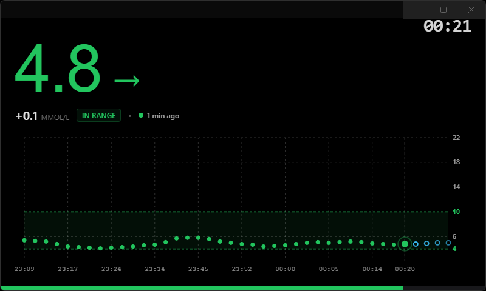

# DeskThing Nightscout App

A  Nightscout CGM dashboard built for [DeskThing](https://github.com/ItsRiprod/DeskThing). Designed with a glanceable mobile-native aesthetic, dynamic target ranges, and real-time forecast projection.

---

## Features

* **High-Legibility Hero Readout**: Large, glanceable blood glucose value, directional trend arrow, delta change, and time elapsed since the last sensor reading.
* **Responsive SVG Scatter Plot**: Dynamically scales to fit any screen resolution or aspect ratio without distortion.
* **Target Range Corridor**: Visual green target threshold corridor with customizable high and low boundaries (`4.0`–`10.0 mmol/L` or `70`–`180 mg/dL`).
* **Loop / OpenAPS Forecast Integration**: Renders future prediction curves directly from `devicestatus.json`, complete with graceful AR2 extrapolation fallbacks.
* **Dual Unit Support**: Native conversion and formatting for both `mmol/L` and `mg/dL`.
* **Zero UI Clutter**: Stripped of unnecessary status bars, battery percentages, and telemetry noise for an authentic glanceable desk clock experience.

More views to come!